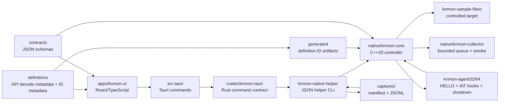

# Architecture

작성일: 2026-06-08

## Scope

This document describes the current Phase 0/Phase 1 foundation and the controlled native-capture paths for `KN Win32 API Monitor`.

The current implementation is intentionally scoped: it has a mock File I/O capture stream, native process enumeration, a controlled launch-time early-bird APC agent load path, bounded same-bitness x64/x86 File I/O capture for the repository sample target, a Phase 11A same-bitness running-process attach path for non-protected sample targets, a Phase 11B helper-side process-tree supervision foundation for deterministic sample children, explicit controlled `NtCreateFile` capture from `ntdll.dll`, deterministic hook lifecycle telemetry, same-bitness preflight diagnostics, and helper-written session replay. It does not support cross-bitness attach, protected-process bypass, stealth loading, manual mapping, or broad arbitrary target supervision.

## Layers



## UI Layer

Location: `apps/knmon-ui`

Responsibilities:

1. Render the primary workstation surface.
2. Present target processes, API capture filter, and capture profiles.
3. Stream mock File I/O events into a live trace table.
4. Maintain selected-event inspector state.
5. Export the current event list as JSONL.
6. Preserve the same event shape intended for future collector events.

Current backend modes:

- `mock`: Browser/Vite mode and mock Tauri target list.
- `native-enum`: Tauri command calls `knmon-native-helper.exe list-targets`.
- `native-capture`: Tauri commands call `knmon-native-helper.exe launch-sample` for HELLO-only proof, `capture-sample` for bounded controlled File I/O capture, `capture-sample --write-session` for persisted sessions, or `replay-session` for disk replay. The helper CLI also exposes `attach-capture --pid` for Phase 11A native attach validation and `supervise-tree --pid` for Phase 11B process-tree validation; UI controls for these paths are still future work.

## Rust/Tauri Command Layer

Locations:

- `apps/knmon-ui/src-tauri`
- `crates/knmon-tauri`

Current commands:

1. `list_target_processes`
2. `get_backend_status`
3. `start_mock_capture_session`
4. `stop_mock_capture_session`
5. `list_native_target_processes`
6. `launch_sample_early_bird_capture`
7. `capture_sample_fileio_events`
8. `capture_sample_fileio_session_events`
9. `replay_last_sample_session`

These commands are deliberately scoped. They prove native enumeration, controlled sample-agent load, and bounded sample File I/O capture. The native helper has smoke-verified attach and process-tree supervision paths, but the UI has not yet promoted them to persistent attach/detach or child-policy controls.

Future work:

1. Stream collector events to the UI.
2. Add explicit command allowlists for attach, detach, start, stop, and export.
3. Preserve subsystem, operation, and native error codes in all failures.

## Native Controller

Location: `native/knmon-core`

Current responsibilities:

1. Define the controller interface.
2. Provide C++20 process enumeration through Toolhelp.
3. Implement controlled launch-time early-bird APC agent load for the sample target.
4. Implement bounded controlled File I/O capture for the sample target.
5. Select the same-bitness x86/x64 agent DLL for controlled launch.
6. Run target/agent architecture preflight before remote mutation.
7. Implement bounded same-bitness `attach-capture --pid` for already-running non-protected sample targets.
8. Implement bounded helper-side `supervise-tree --pid` process-tree discovery and child policy evaluation.
9. Keep broad arbitrary attach, persistent daemon supervision, and UI-driven child auto-attach outside the current controller surface.

The controller is wired into Tauri through `knmon-native-helper.exe` for native enumeration, controlled launch-time early-bird agent loading, and bounded sample File I/O capture. The same helper exposes Phase 11A attach and Phase 11B process-tree smoke validation from the CLI.

Future responsibilities:

1. Launch suspended targets.
2. Repeated attach/detach to selected targets.
3. Supervise long-running agent lifecycle.
4. Manage child process auto-attach policy.
5. Move the current shared-memory drain from the controller into a dedicated collector reader.

Current controlled launch behavior:

1. Validate sample target and agent paths plus same-bitness architecture.
2. Create the target process suspended.
3. Create a named pipe for the agent HELLO handshake.
4. Write the absolute agent DLL path into the target process.
5. Queue `LoadLibraryW` through an early-bird APC on the suspended primary thread.
6. Resume the primary thread.
7. Wait for a versioned HELLO payload from the same-bitness agent.

Current preflight behavior:

1. Confirm target binary exists and is a supported PE image.
2. Confirm agent binary exists and is a supported PE image.
3. Confirm helper architecture is known.
4. Confirm requested architecture matches helper architecture.
5. Confirm target binary architecture matches requested architecture.
6. Confirm agent DLL architecture matches requested architecture.
7. Fail before `CreateProcessW` when these checks fail.

Current binary-open diagnostics distinguish missing paths, true access-denied failures, and other target/agent open errors so preflight does not mislabel every non-missing failure as a permission problem.

Current bounded capture behavior:

1. Use the same controlled early-bird launch path.
2. Create a bounded shared-memory ring before target resume and pass the mapping name to the agent.
3. Keep the named pipe open for low-volume `agent_hello`, hook status, dropped-event summary, and `agent_shutdown` messages.
4. Collect API call records from shared memory and normalize them outside the target process into schema-versioned `api_call` events.
5. Return a structured `capture-result` JSON object to Rust/Tauri with transport mode, produced/consumed/dropped record counts, high-water mark, and min/average/max hook overhead metrics.
6. Optionally write a session directory containing manifest, audit, raw agent event, and trace event files.
7. Map `api_call` events into the existing UI trace table.

Current running-process attach behavior:

1. The sample target can run as `knmon-sample-fileio.exe --attach-loop --iterations N --delay-ms N` before the helper injects anything.
2. `attach-capture --pid <pid>` queries process snapshot metadata, target architecture, protection state where detectable, agent DLL architecture, and required mutation-handle access before remote mutation.
3. PID `0`, PID `4`, the helper process itself, missing targets, missing agents, agent/helper mismatch, and helper/target mismatch fail during preflight with typed operations.
4. For supported same-bitness non-protected targets, the controller creates the named pipe and shared-memory transport before remote mutation.
5. The controller writes the absolute agent path and a fixed-size `KnMonAttachConfigV1` structure into remote memory.
6. Remote `LoadLibraryW` loads the same-bitness agent DLL.
7. The controller resolves exported agent entrypoints by local export RVA plus remote module base, then calls `KnMonAgentInitialize` with the remote attach config.
8. Attach configuration carries the operation id, named pipe, transport mapping name, attach mode, ABI version, and future reserved fields. It does not rely on target environment variables.
9. The controller drains shared-memory API records for a bounded duration, calls `KnMonAgentStop`, waits for `agent_shutdown reason=self_disable`, and releases remote buffers when possible.
10. Phase 11A detach means hooks restored and agent disabled. The DLL is intentionally not unloaded.

Current process-tree supervision behavior:

1. The sample target can run as `knmon-sample-fileio.exe --spawn-child-loop --children N --child-iterations N --delay-ms N`.
2. The root sample prints `tree-root-ready`, then starts deterministic child sample processes that run the existing attach loop.
3. `supervise-tree --pid <root> --child-policy observe` validates the already-running root, polls Toolhelp process snapshots for a bounded duration, and records root/child nodes.
4. Each node records PID, parent PID, image name/path, architecture, first/last seen timestamps, alive/exited state, eligibility, policy decision, and message.
5. Observe policy evaluates children but never calls remote mutation APIs or `AttachCapture`.
6. `--child-policy attach-supported` only attaches same-bitness repository sample children that pass eligibility checks, then embeds the existing Phase 11A `bounded-native-attach` result in `childAttachResults`.
7. Cross-bitness, protected, access-denied, missing, exited, and unsupported children are classified as policy decisions before mutation.
8. Process-tree supervision is controller/helper-side work. It does not add agent-side polling, hook-path JSON, or hook fast-path overhead.

Current shared-memory transport behavior:

1. API hooks reserve fixed-size binary records with API id, module id, process/thread id, timing fields, return/error fields, bounded numeric slots, and bounded text slots.
2. API hook fast paths do not serialize API JSON and do not write API events to the named pipe.
3. The ring uses drop-newest overflow accounting when producer depth reaches capacity.
4. `KNMON_TRANSPORT_CAPACITY` can force a smaller capacity for pressure smoke tests.
5. The controller reconstructs current JSON-compatible trace rows after draining the binary records.

## Collector

Location: `native/knmon-collector`

Current behavior:

1. Starts as a small console executable.
2. Prints protocol version.
3. Exercises native target enumeration in no-argument mode.
4. Provides a deterministic synthetic backpressure smoke path.
5. Enforces a bounded queue with explicit `drop-newest` overflow policy.
6. Tracks accepted, drained, dropped, queue depth, high-water mark, and backpressure activation counts.

Current smoke command:

```powershell
build\native\Debug\knmon-collector.exe smoke-backpressure --capacity 4 --events 10
```

This command does not launch, inject, attach, or consume process handles. It pushes synthetic normalized events into the collector, drains retained events, and emits machine-readable JSON. With capacity 4 and 10 events, retained sequences must stay FIFO as `1,2,3,4`, `droppedEvents` must be `6`, and `highWaterMark` must be `4`.

Future behavior:

1. Move the current controller-side shared-memory drain into a dedicated collector reader.
2. Write `.knapm` session chunks.
3. Stream events to Tauri/UI.
4. Add high-volume multi-threaded transport after the bounded policy stays stable.

## Agents

Locations:

- `native/knmon-agent32`
- `native/knmon-agent64`

`knmon-agent64` and `knmon-agent32` share one agent implementation source. In controlled launch mode, each starts a worker thread from `DllMain`, reads `KNMON_AGENT_PIPE`, `KNMON_OPERATION_ID`, and the optional required shared-memory transport mapping name, writes a versioned JSON HELLO payload with its actual architecture, inventories loaded modules from the PEB loader list, sweeps eligible non-agent non-system module IATs, and writes File I/O, loader, resolver, and selected Wave 2 API records into shared memory.

In attach mode, `DllMain` stores the module handle and disables thread-library callbacks but does not require launch-time environment variables. The controller calls `KnMonAgentInitialize(const KnMonAttachConfigV1*)` after remote `LoadLibraryW`; the initializer validates magic, struct size, ABI version, attach mode, required bounded strings, and transport requirements before starting the same worker exactly once. `KnMonAgentStop()` triggers the self-disable path used by bounded attach detach.

Current lifecycle states:

1. `starting`
2. `running`
3. `stopping`
4. `disabled`
5. `failed`

The agent tracks every patched IAT slot with API name, imported provider module, owner module, thunk address, original function, replacement function, and install/restore state. During shutdown or self-disable it turns off new hook events, restores original IAT values where possible, treats already-unloaded owner modules as conservatively restored without stale writes, and emits `agent_shutdown`.

Current `agent_shutdown` fields:

1. `reason`
2. `lifecycleState`
3. `installedHooks`
4. `restoredHooks`
5. `failedHooks`
6. `droppedCount`

`knmon-agent32` is built from the shared agent source in Win32 CMake builds and is limited to same-bitness controlled sample launches or same-bitness Phase 11A attach validation from the Win32 helper.

Current same-bitness x64/x86 hook coverage:

1. `CreateFileW`
2. `CreateFileA`
3. `NtCreateFile`
4. `ReadFile`
5. `WriteFile`
6. `CloseHandle`
7. `LoadLibraryW`
8. `GetProcAddress`
9. `LdrGetProcedureAddress`

`NtCreateFile` is captured as an explicit `ntdll.dll` event. Its `returnValue` is the NTSTATUS hex string, while `lastErrorCode` remains a mapped Win32 error code for failure display compatibility. The current controlled sample success path returns `0x00000000` and includes bounded `OBJECT_ATTRIBUTES.ObjectName` evidence.

Current loader-aware behavior:

1. The initial agent worker snapshots the PEB loader list and emits `module_inventory`.
2. The initial IAT sweep emits `iat_sweep` with scanned, eligible, skipped, patched, duplicate, and failed slot counts.
3. Eligible patch-owner modules exclude the agent and Windows system modules; Wave 1 provider modules remain `kernel32.dll`, `kernelbase.dll`, and `ntdll.dll`.
4. The sample target loads `knmon-dynamic-probe.dll`; `LoadLibraryW` is captured as a loader `api_call`.
5. A successful dynamic load triggers a re-sweep with `reason=dynamic_load`.
6. The dynamic probe DLL performs File I/O after load, proving post-load IAT coverage.
7. The sample resolves `KnMonDynamicProbe` through `GetProcAddress` and `LdrGetProcedureAddress`, proving resolver API call visibility without claiming returned-pointer instrumentation.

Current agent limitations:

1. Hooks are installed only in repository-controlled sample launch flow or explicit same-bitness Phase 11A attach validation.
2. Hook method is eligible-module IAT patching, not inline trampoline or EAT patching.
3. API event transport is shared memory for the controlled sample path; named pipe remains for low-volume control and lifecycle messages.
4. Shutdown cleanup is scoped to controlled sample launch or attach self-disable; repeated same-process reattach and broad arbitrary detach remain unsupported.
5. Cross-bitness injection is rejected during preflight.
6. Calls made through resolver-returned function pointers are not automatically instrumented unless the later call path is also covered by an eligible IAT hook.

Future agent responsibilities:

1. Capture richer call stack metadata when explicitly enabled.
2. Support a dedicated collector reader for high-volume shared-memory transport.
3. Expand loader-aware system DLL coverage beyond Wave 1.
4. Add persistent attach/detach supervision only after a separate review.

`Launch Sample` still produces an `agent_loaded` row only. `Capture File I/O` produces real `api_call` rows from the controlled sample target.

## Session Writer And Replay

Current helper session format:

1. `manifest.json`
2. `audit.jsonl`
3. `agent-events.jsonl`
4. `trace-events.jsonl`

`capture-sample --write-session <dir>` and `attach-capture --pid <pid> --write-session <dir>` write bounded captures to disk. The writer stores raw audit events, raw agent messages, and trace-compatible rows separately so replay can be deterministic and avoid launching or injecting a target.

`validate-session --session <dir>` checks the manifest, required files, HELLO architecture/version evidence, dropped-event accounting event, shutdown lifecycle event, clean hook restore counts, and non-empty trace rows. `replay-session --session <dir>` validates first, then returns a `session-replay` result with the trace rows loaded from disk.

The default UI session path is `captures/latest-sample-fileio`. Generated session directories remain ignored by git; test fixtures live under `tests/fixtures/session`.

## Protocol Contracts

Location: `contracts`

Current contract artifacts:

1. `protocol-version.json`
2. `api-definition.schema.json`
3. `definition-metadata.schema.json`
4. `event.schema.json`
5. `argument.schema.json`
6. `memory-snapshot.schema.json`
7. `target-process.schema.json`
8. `capture-session-state.schema.json`
9. `launch-request.schema.json`
10. `launch-result.schema.json`
11. `agent-handshake.schema.json`
12. `audit-event.schema.json`
13. `agent-event.schema.json`
14. `hook-status.schema.json`
15. `capture-result.schema.json`
16. `session-info.schema.json`
17. `session-manifest.schema.json`
18. `session-replay-result.schema.json`
19. `collector-stats.schema.json`
20. `process-tree-node.schema.json`
21. `process-tree-result.schema.json`

The TypeScript event model and C++ `Protocol.h` are aligned around these fields, including `bounded-native-capture`, `bounded-native-attach`, `early-bird APC`, `remote LoadLibraryW`, `attachProcessId`, `detachPolicy`, `process-tree`, `observe`, `attach-supported`, child eligibility, and child policy decisions.

## Definition System

Locations:

1. `definitions/win32`
2. `definitions/metadata`
3. `generated`
4. `tools/def-validator`
5. `tools/rohitab-importer`

Definition System V1 keeps decode metadata outside the target process. API definition JSON files are validated by `contracts/api-definition.schema.json`, while decode aliases, enum sets, flag sets, and stable ID assignments are validated by `contracts/definition-metadata.schema.json` plus semantic checks.

Current metadata registries:

1. `definitions/metadata/decode-aliases.json`
2. `definitions/metadata/enums.json`
3. `definitions/metadata/flags.json`
4. `definitions/metadata/id-assignments.json`

Generated ID artifacts:

1. `generated/definition-ids.json`
2. `native/knmon-common/include/knmon/common/GeneratedApiIds.h`

`Protocol.h` includes `GeneratedApiIds.h`, so the current compact shared-memory transport API and module IDs are generated from the stable assignment metadata. The generated values preserve the existing File I/O ids `1` through `6`, loader ids `7` through `11`, and Wave 1 module ids for `kernel32.dll`, `ntdll.dll`, and `kernelbase.dll`.

The injected agent does not parse JSON, XML, schemas, or metadata registries. Generated IDs are compile-time constants; schema validation, Rohitab XML import, coverage reporting, enum/flag validation, decode alias validation, and length-expression validation run only in repository tooling.

## Session And Export

Current export:

- UI exports mock events to JSONL.
- UI also exports captured native trace rows after bounded sample capture because they use the same trace model.
- Each row includes `schemaVersion`.
- The helper writes replayable sample and attach sessions as manifest + JSONL files.
- The UI can replay the last helper-written sample session into the trace table.

Future session format:

- `.knapm`
- manifest + metadata database + zstd event chunks.
- crash-tolerant append-only writer.
- indexed replay and export tools.

## Safety Rules

1. Keep attach limited to explicit same-bitness, non-protected Phase 11A targets and Phase 11B repository sample children until broader target policy is reviewed.
2. Keep mock and real backends behind the same UI-facing interface.
3. Expose dropped event accounting in the UI from the start.
4. Treat PPL/protected/unsupported processes as explicit limited states.
5. Keep mutation features out of the MVP.
