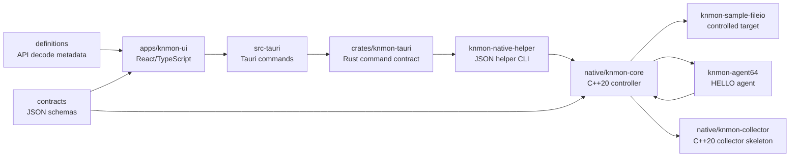

# Architecture

작성일: 2026-06-08

## Scope

This document describes the current Phase 0/Phase 1 foundation for `KN Win32 API Monitor`.

The current implementation is intentionally scoped: it has a mock File I/O capture stream, native process enumeration, and a controlled launch-time early-bird APC agent load path for the repository sample target. It does not inject into arbitrary already-running processes.

## Layers

## UI Layer

Location: `apps/knmon-ui`

Responsibilities:

1. Render the primary workstation surface.
2. Present target processes, API capture filter, and capture profiles.
3. Stream mock File I/O events into a live trace table.
4. Maintain selected-event inspector state.
5. Export the current event list as JSONL.
6. Preserve the same event shape intended for future collector events.

Current backend modes:

- `mock`: Browser/Vite mode and mock Tauri target list.
- `native-enum`: Tauri command calls `knmon-native-helper.exe list-targets`.
- `native-capture`: Tauri command calls `knmon-native-helper.exe launch-sample` for controlled early-bird agent load.

## Rust/Tauri Command Layer

Locations:

- `apps/knmon-ui/src-tauri`
- `crates/knmon-tauri`

Current commands:

1. `list_target_processes`
2. `get_backend_status`
3. `start_mock_capture_session`
4. `stop_mock_capture_session`
5. `list_native_target_processes`
6. `launch_sample_early_bird_capture`

These commands are deliberately scoped. They prove native enumeration and controlled sample-agent load without pretending that arbitrary attach or API hooks exist.

Future work:

1. Stream collector events to the UI.
2. Add explicit command allowlists for attach, detach, start, stop, and export.
3. Preserve subsystem, operation, and native error codes in all failures.

## Native Controller

Location: `native/knmon-core`

Current responsibilities:

1. Define the controller interface.
2. Provide C++20 process enumeration through Toolhelp.
3. Implement controlled launch-time early-bird APC agent load for the sample target.
4. Define arbitrary attach/detach/start/stop capture boundaries as not-implemented operations.

The controller is wired into Tauri through `knmon-native-helper.exe` for native enumeration and controlled launch-time early-bird agent loading.

Future responsibilities:

1. Launch suspended targets.
2. Attach/detach to selected targets.
3. Select x86/x64 agent DLLs.
4. Supervise agent lifecycle.
5. Manage child process auto-attach policy.

Current controlled launch behavior:

1. Validate sample target and agent paths.
2. Create the target process suspended.
3. Create a named pipe for the agent HELLO handshake.
4. Write the absolute agent DLL path into the target process.
5. Queue `LoadLibraryW` through an early-bird APC on the suspended primary thread.
6. Resume the primary thread.
7. Wait for a versioned HELLO payload from the x64 agent.

## Collector

Location: `native/knmon-collector`

Current behavior:

1. Starts as a small console executable.
2. Prints protocol version.
3. Exercises native target enumeration.
4. States that capture is mock-only.

Future behavior:

1. Consume shared-memory ring buffer events.
2. Normalize event records.
3. Track dropped events and backpressure.
4. Write `.knapm` session chunks.
5. Stream events to Tauri/UI.

## Agents

Locations:

- `native/knmon-agent32`
- `native/knmon-agent64`

`knmon-agent64` is implemented as a minimal HELLO agent. It starts a worker thread from `DllMain`, reads `KNMON_AGENT_PIPE` and `KNMON_OPERATION_ID`, and writes a versioned JSON HELLO payload to the controller pipe.

`knmon-agent32` remains a skeleton for a later Win32 generator/toolchain pass.

Future agent responsibilities:

1. Install selected API hooks.
2. Snapshot pre-call parameters.
3. Snapshot post-call return values and error state.
4. Capture bounded memory buffers safely.
5. Capture call stack metadata.
6. Write compact records to collector IPC.

The current agent does not install hooks yet. A successful `agent_loaded` row means load and handshake only.

## Protocol Contracts

Location: `contracts`

Current contract artifacts:

1. `protocol-version.json`
2. `event.schema.json`
3. `argument.schema.json`
4. `memory-snapshot.schema.json`
5. `target-process.schema.json`
6. `capture-session-state.schema.json`
7. `launch-request.schema.json`
8. `launch-result.schema.json`
9. `agent-handshake.schema.json`
10. `audit-event.schema.json`

The TypeScript event model and C++ `Protocol.h` are aligned around these Phase 1 fields.

## Session And Export

Current export:

- UI exports mock events to JSONL.
- Each row includes `schemaVersion`.

Future session format:

- `.knapm`
- manifest + metadata database + zstd event chunks.
- crash-tolerant append-only writer.
- replay and export tools.

## Safety Rules

1. Do not add arbitrary already-running process injection until controlled launch and sample-agent capture are reviewed.
2. Keep mock and real backends behind the same UI-facing interface.
3. Expose dropped event accounting in the UI from the start.
4. Treat PPL/protected/unsupported processes as explicit limited states.
5. Keep mutation features out of the MVP.
