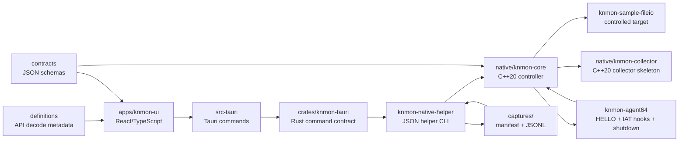

# Architecture

작성일: 2026-06-08

## Scope

This document describes the current Phase 0/Phase 1 foundation and the first controlled native-capture path for `KN Win32 API Monitor`.

The current implementation is intentionally scoped: it has a mock File I/O capture stream, native process enumeration, a controlled launch-time early-bird APC agent load path, bounded x64 File I/O capture for the repository sample target, deterministic x64 hook lifecycle telemetry, and helper-written session replay. It does not inject into arbitrary already-running processes.

## Layers

## UI Layer

Location: `apps/knmon-ui`

Responsibilities:

1. Render the primary workstation surface.
2. Present target processes, API capture filter, and capture profiles.
3. Stream mock File I/O events into a live trace table.
4. Maintain selected-event inspector state.
5. Export the current event list as JSONL.
6. Preserve the same event shape intended for future collector events.

Current backend modes:

- `mock`: Browser/Vite mode and mock Tauri target list.
- `native-enum`: Tauri command calls `knmon-native-helper.exe list-targets`.
- `native-capture`: Tauri commands call `knmon-native-helper.exe launch-sample` for HELLO-only proof, `capture-sample` for bounded controlled File I/O capture, `capture-sample --write-session` for persisted sessions, or `replay-session` for disk replay.

## Rust/Tauri Command Layer

Locations:

- `apps/knmon-ui/src-tauri`
- `crates/knmon-tauri`

Current commands:

1. `list_target_processes`
2. `get_backend_status`
3. `start_mock_capture_session`
4. `stop_mock_capture_session`
5. `list_native_target_processes`
6. `launch_sample_early_bird_capture`
7. `capture_sample_fileio_events`
8. `capture_sample_fileio_session_events`
9. `replay_last_sample_session`

These commands are deliberately scoped. They prove native enumeration, controlled sample-agent load, and bounded sample File I/O capture without pretending that arbitrary attach exists.

Future work:

1. Stream collector events to the UI.
2. Add explicit command allowlists for attach, detach, start, stop, and export.
3. Preserve subsystem, operation, and native error codes in all failures.

## Native Controller

Location: `native/knmon-core`

Current responsibilities:

1. Define the controller interface.
2. Provide C++20 process enumeration through Toolhelp.
3. Implement controlled launch-time early-bird APC agent load for the sample target.
4. Implement bounded controlled File I/O capture for the sample target.
4. Define arbitrary attach/detach/start/stop capture boundaries as not-implemented operations.

The controller is wired into Tauri through `knmon-native-helper.exe` for native enumeration, controlled launch-time early-bird agent loading, and bounded sample File I/O capture.

Future responsibilities:

1. Launch suspended targets.
2. Attach/detach to selected targets.
3. Select x86/x64 agent DLLs.
4. Supervise agent lifecycle.
5. Manage child process auto-attach policy.

Current controlled launch behavior:

1. Validate sample target and agent paths.
2. Create the target process suspended.
3. Create a named pipe for the agent HELLO handshake.
4. Write the absolute agent DLL path into the target process.
5. Queue `LoadLibraryW` through an early-bird APC on the suspended primary thread.
6. Resume the primary thread.
7. Wait for a versioned HELLO payload from the x64 agent.

Current bounded capture behavior:

1. Use the same controlled early-bird launch path.
2. Keep the named pipe open for line/message-style agent events.
3. Collect `agent_hello`, `hook_installed`, `api_call`, `dropped_events`, and `agent_shutdown` messages until the sample exits or a bounded timeout fires.
4. Return a structured `capture-result` JSON object to Rust/Tauri.
5. Optionally write a session directory containing manifest, audit, raw agent event, and trace event files.
6. Map `api_call` events into the existing UI trace table.

## Collector

Location: `native/knmon-collector`

Current behavior:

1. Starts as a small console executable.
2. Prints protocol version.
3. Exercises native target enumeration.
4. States that capture is mock-only.

Future behavior:

1. Consume shared-memory ring buffer events.
2. Normalize event records.
3. Track dropped events and backpressure.
4. Write `.knapm` session chunks.
5. Stream events to Tauri/UI.

## Agents

Locations:

- `native/knmon-agent32`
- `native/knmon-agent64`

`knmon-agent64` starts a worker thread from `DllMain`, reads `KNMON_AGENT_PIPE` and `KNMON_OPERATION_ID`, writes a versioned JSON HELLO payload, installs controlled sample-target IAT hooks, and emits `api_call` events for the stable File I/O set.

Current lifecycle states:

1. `starting`
2. `running`
3. `stopping`
4. `disabled`
5. `failed`

The x64 agent tracks every patched IAT slot with API name, module, thunk address, original function, replacement function, and install/restore state. During shutdown or self-disable it turns off new hook events, restores original IAT values where possible, and emits `agent_shutdown`.

Current `agent_shutdown` fields:

1. `reason`
2. `lifecycleState`
3. `installedHooks`
4. `restoredHooks`
5. `failedHooks`
6. `droppedCount`

`knmon-agent32` remains a skeleton for a later Win32 generator/toolchain pass.

Current x64 hook coverage:

1. `CreateFileW`
2. `CreateFileA`
3. `ReadFile`
4. `WriteFile`
5. `CloseHandle`

Current x64 agent limitations:

1. Hooks are installed only in the repository-controlled sample target flow.
2. Hook method is IAT patching of the main module, not inline trampoline or EAT patching.
3. `NtCreateFile` is still definition-only for live capture.
4. Event transport is a bounded named-pipe path, not shared memory.
5. Shutdown cleanup is scoped to the controlled sample target lifecycle; arbitrary detach from already-running processes remains unsupported.

Future agent responsibilities:

1. Support x86 with the same protocol.
2. Capture richer call stack metadata.
3. Move high-volume events to collector shared memory.
4. Add `NtCreateFile` after Win32 hooks stay stable.
5. Add arbitrary attach/detach only after a separate review.

`Launch Sample` still produces an `agent_loaded` row only. `Capture File I/O` produces real `api_call` rows from the controlled sample target.

## Session Writer And Replay

Current helper session format:

1. `manifest.json`
2. `audit.jsonl`
3. `agent-events.jsonl`
4. `trace-events.jsonl`

`capture-sample --write-session <dir>` writes the current bounded sample capture to disk. The writer stores raw audit events, raw agent messages, and trace-compatible rows separately so replay can be deterministic and avoid launching or injecting a target.

`validate-session --session <dir>` checks the manifest, required files, HELLO event, dropped-event accounting event, shutdown lifecycle event, clean hook restore counts, and non-empty trace rows. `replay-session --session <dir>` validates first, then returns a `session-replay` result with the trace rows loaded from disk.

The default UI session path is `captures/latest-sample-fileio`. Generated session directories remain ignored by git; test fixtures live under `tests/fixtures/session`.

## Protocol Contracts

Location: `contracts`

Current contract artifacts:

1. `protocol-version.json`
2. `event.schema.json`
3. `argument.schema.json`
4. `memory-snapshot.schema.json`
5. `target-process.schema.json`
6. `capture-session-state.schema.json`
7. `launch-request.schema.json`
8. `launch-result.schema.json`
9. `agent-handshake.schema.json`
10. `audit-event.schema.json`
11. `agent-event.schema.json`
12. `hook-status.schema.json`
13. `capture-result.schema.json`
14. `session-info.schema.json`
15. `session-manifest.schema.json`
16. `session-replay-result.schema.json`

The TypeScript event model and C++ `Protocol.h` are aligned around these Phase 1 fields.

## Session And Export

Current export:

- UI exports mock events to JSONL.
- UI also exports captured native trace rows after bounded sample capture because they use the same trace model.
- Each row includes `schemaVersion`.
- The helper writes replayable sample sessions as manifest + JSONL files.
- The UI can replay the last helper-written sample session into the trace table.

Future session format:

- `.knapm`
- manifest + metadata database + zstd event chunks.
- crash-tolerant append-only writer.
- indexed replay and export tools.

## Safety Rules

1. Do not add arbitrary already-running process injection until controlled launch and sample-agent capture are reviewed.
2. Keep mock and real backends behind the same UI-facing interface.
3. Expose dropped event accounting in the UI from the start.
4. Treat PPL/protected/unsupported processes as explicit limited states.
5. Keep mutation features out of the MVP.
