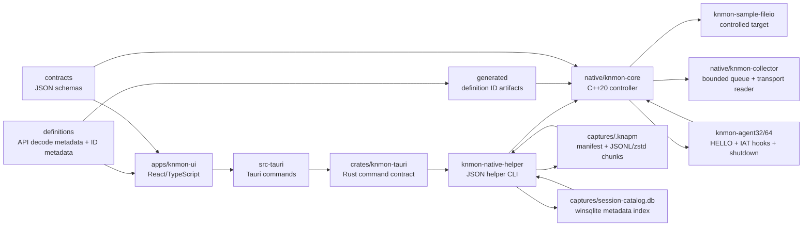

# Architecture

작성일: 2026-06-08

## Scope

This document describes the current Phase 0/Phase 1 foundation and the controlled native-capture paths for `KN Win32 API Monitor`.

The current implementation is intentionally scoped: it has a mock File I/O capture stream, native process enumeration, a controlled launch-time early-bird APC agent load path, bounded same-bitness x64/x86 File I/O capture for the repository sample target, same-bitness running-process attach for non-protected sample targets, helper-side process-tree supervision for deterministic sample children, cancellation-safe operation ownership, durable `.knapm` chunk writing and indexed replay, `.knapm` restart/recovery ownership classification, host-side persistent daemon supervision, daemon audit/stale-registry hardening, zstd `.knapm` chunks, JSON replay catalogs, database-backed replay catalog indexing, event-level trace indexing and full-text replay search, catalog-backed replay UX, virtualized trace rendering, UI-side query/error/thread/timeline/highlight analysis, selected low-payload Wave 2/3 hook slices, Wave 4 definition-only metadata, explicit controlled `NtCreateFile` capture from `ntdll.dll`, deterministic hook lifecycle telemetry, same-bitness preflight diagnostics, and helper-written session replay.

It does not support cross-bitness attach, protected-process bypass, stealth loading, manual mapping, Windows service mode, automatic daemon crash recovery, unbounded arbitrary-target streaming, broad arbitrary target supervision, UI/GDI payload capture such as window text, pixels, screenshots, clipboard, input, or message hooks, process enumeration payload capture, process creation payload capture, PSAPI-derived module memory/PE/file/hash/signature payload capture, raw version-resource/string-table capture, RPC endpoint/auth/network payload capture, WinHTTP request/transfer/header/body/cookie/credential payload capture, ShellExecute/process launch, PIDL/Shell namespace payload capture, arbitrary Shell file metadata, COM/WinRT activation/object/interface/vtable/marshaling/storage/clipboard/drag-drop payload capture, HSTRING/runtime-class/restricted-error-info capture, synchronization object names, file-mapping object names, object-manager namespace paths, synchronization handle-array contents, mapped memory contents, security descriptors, SID/ACL/token data, wait-chain/APC queue payload capture, memory-content capture, file-content/path/name/directory payload capture beyond selected handle-based scalar file metadata, remote process memory API capture, injection helper capture, remote-thread/APC/context/stack capture, user-folder path capture, command-line capture, or environment capture.

## Layers



## UI Layer

Location: `apps/knmon-ui`

Responsibilities:

1. Render the primary workstation surface.
2. Present target processes, API capture filter, and capture profiles.
3. Stream mock File I/O events into a live trace table.
4. Maintain selected-event inspector state.
5. Export the current event list as JSONL.
6. Preserve the same event shape intended for future collector events.
7. In Tauri desktop mode, select a native target and invoke bounded attach, daemon-supervised attach, or process-tree helper commands with explicit eligibility and audit output.

Current backend modes:

- `mock`: Browser/Vite mode and mock Tauri target list.
- `native-enum`: Tauri command calls `knmon-native-helper.exe list-targets`.
- `native-capture`: Tauri commands call `knmon-native-helper.exe launch-sample` for HELLO-only proof, `capture-sample` for bounded controlled File I/O capture, `capture-sample --write-session` for persisted legacy sessions, `replay-session` for legacy or `.knapm` disk replay, `attach-capture --pid` for bounded selected-target attach, `attach-session --stream-batches` for bounded UI streaming attach sessions, `attach-session --stream-batches --write-knapm [--knapm-compression none|zstd]` for durable chunk writing, `daemon-start-session --write-knapm [--knapm-compression none|zstd]` for daemon-owned durable sessions, `catalog-sessions`/`catalog-query`/`catalog-remove-missing` for host-side JSON replay catalog management, `catalog-index-build`/`catalog-index-query`/`catalog-index-remove-missing` for host-side database-backed catalog indexing, `daemon-audit`/`daemon-recovery-plan`/`daemon-prune-stale` for daemon registry inspection, dry-run operator recovery planning, and stale cleanup, or `supervise-tree --pid` for process-tree observation/attach-supported policy evaluation.

## Rust/Tauri Command Layer

Locations:

- `apps/knmon-ui/src-tauri`
- `crates/knmon-tauri`

Current commands:

1. `list_target_processes`
2. `get_backend_status`
3. `start_mock_capture_session`
4. `stop_mock_capture_session`
5. `list_native_target_processes`
6. `launch_sample_early_bird_capture`
7. `capture_sample_fileio_events`
8. `capture_sample_fileio_session_events`
9. `replay_last_sample_session`
10. `attach_target_process_capture`
11. `supervise_process_tree`
12. `list_native_operations`
13. `cancel_native_operation`
14. `list_native_sessions`
15. `stop_native_session`
16. `start_streaming_attach_session`
17. `drain_native_trace_batches`
18. `replay_session_path`
19. `start_daemon_if_needed`
20. `native_daemon_status`
21. `list_daemon_sessions`
22. `audit_daemon_sessions`
23. `plan_daemon_recovery`
24. `prune_stale_daemon_sessions`
25. `start_daemon_supervised_session`
26. `stop_daemon_session`
27. `catalog_native_sessions`
28. `query_native_session_catalog`
29. `remove_missing_native_session_catalog_entries`
30. `build_native_session_catalog_index`
31. `query_native_session_catalog_index`
32. `remove_missing_native_session_catalog_index_entries`

These commands are deliberately scoped. They prove native enumeration, controlled sample-agent load, bounded sample File I/O capture, bounded same-bitness selected-target attach, helper-side process-tree supervision, cancellation-safe ownership for bounded helper operations, host-side session state visibility, bounded streaming trace batches for a selected same-bitness attach session, daemon-owned durable `.knapm` session supervision, compressed chunk validation/replay, read-only replay catalog build/query, database-backed catalog index build/query/prune, read-only daemon audit, dry-run daemon recovery planning, stale registry pruning, and replay by explicit session path. The daemon and catalog commands use a normal user-mode helper process and local files; the Phase 12A UI calls only these existing host-side catalog/replay commands for replay browsing, and Phase 13A adds only host-side `winsqlite3` metadata indexing over `.knapm` rows. They do not create a Windows service, injected command channel, cross-bitness broker, protected-process bypass, automatic writer recovery, orphan repair path, or target mutation during replay/catalog/index/plan operations.

Current daemon hardening boundary:

1. `daemon-status` reports `daemonState=stale` when a registry state exists but the daemon PID is dead.
2. `daemon-audit` classifies daemon sessions as `healthy`, `finalized`, `stale`, `daemon_crashed`, `writer_crashed`, `orphaned_agent_risk`, or `malformed` without target mutation.
3. `daemon-recovery-plan` returns dry-run operator runbooks, allowed registry-prune hints, and blocked mutation lists without target, agent, registry, or `.knapm` mutation.
4. `daemon-prune-stale --dry-run` reports only `pruneEligible` registry records; non-dry-run pruning removes daemon registry JSON records only.
5. Duplicate daemon starts reject live target, live session id, live `.knapm` path, and stale registry conflicts before launching a new attach helper.

Future work:

1. Add explicit command allowlists for future export operations.
2. Preserve subsystem, operation, and native error codes in all failures.
3. Design automatic daemon recovery only after orphaned active-agent operations have a separate safety review and the dry-run plan contract has negative mutation regression coverage.

## Native Controller

Location: `native/knmon-core`

Current responsibilities:

1. Define the controller interface.
2. Provide C++20 process enumeration through Toolhelp.
3. Implement controlled launch-time early-bird APC agent load for the sample target.
4. Implement bounded controlled File I/O capture for the sample target.
5. Select the same-bitness x86/x64 agent DLL for controlled launch.
6. Run target/agent architecture, process liveness, PID identity, protection, mitigation, and access preflight before remote mutation.
7. Implement bounded same-bitness `attach-capture --pid` for already-running non-protected sample targets.
8. Implement bounded helper-side `supervise-tree --pid` process-tree discovery and child policy evaluation.
9. Implement cancellation checks and cleanup accounting for bounded attach and process-tree operations.
10. Populate additive host-side session state fields for bounded attach and process-tree results.
11. Emit bounded host-side trace batch callbacks for attach-session streaming without adding agent hook-path work.
12. Keep broad arbitrary attach, Windows service mode, automatic daemon crash recovery, and UI-driven child auto-attach outside the current controller surface.

The controller is wired into Tauri through `knmon-native-helper.exe` for native enumeration, controlled launch-time early-bird agent loading, bounded sample File I/O capture, Phase 11A attach, Phase 11B process-tree supervision, Phase 11D loaded-agent reattach state, Phase 11E collector-reader backed shared-memory drain, Phase 11F named-event cancellation, Phase 11G session-state evidence, Phase 11H streaming `trace_batch` frames, Phase 11I `.knapm` chunk persistence, Phase 11J `.knapm` recovery classification, Phase 11K daemon-owned session supervision, Phase 11L daemon audit/stale-registry cleanup, and Phase 11M zstd/catalog replay metadata. The UI-visible Phase 11C/11F/11G/11H/11K/11L/11M/12A path uses the same helper JSON/JSONL as the smoke scripts.

Future responsibilities:

1. Launch suspended targets.
2. Design large-scale database-backed replay indexing after the JSON catalog contract remains stable.
3. Design automatic daemon crash recovery and orphaned agent repair behind a separate safety boundary after dry-run plan evidence remains stable.
4. Manage persistent child process auto-attach policy.
5. Promote host-side threaded reader output to full UI event streaming after daemon ownership is reviewed.

Current controlled launch behavior:

1. Validate sample target and agent paths plus same-bitness architecture.
2. Create the target process suspended.
3. Create a named pipe for the agent HELLO handshake.
4. Write the absolute agent DLL path into the target process.
5. Queue `LoadLibraryW` through an early-bird APC on the suspended primary thread.
6. Resume the primary thread.
7. Wait for a versioned HELLO payload from the same-bitness agent.

Current preflight behavior:

1. Confirm target binary exists and is a supported PE image.
2. Confirm agent binary exists and is a supported PE image.
3. Confirm helper architecture is known.
4. Confirm requested architecture matches helper architecture.
5. Confirm target binary architecture matches requested architecture.
6. Confirm agent DLL architecture matches requested architecture.
7. Fail before `CreateProcessW` when these checks fail.

Current binary-open diagnostics distinguish missing paths, true access-denied failures, and other target/agent open errors so preflight does not mislabel every non-missing failure as a permission problem.

Current bounded capture behavior:

1. Use the same controlled early-bird launch path.
2. Create a bounded shared-memory ring before target resume and pass the mapping name to the agent.
3. Keep the named pipe open for low-volume `agent_hello`, hook status, dropped-event summary, and `agent_shutdown` messages.
4. Collect API call records from shared memory and normalize them outside the target process into schema-versioned `api_call` events.
5. Return a structured `capture-result` JSON object to Rust/Tauri with transport mode, produced/consumed/dropped record counts, high-water mark, and min/average/max hook overhead metrics.
6. Optionally write a session directory containing manifest, audit, raw agent event, and trace event files.
7. Map `api_call` events into the existing UI trace table.

Current running-process attach behavior:

1. The sample target can run as `knmon-sample-fileio.exe --attach-loop --iterations N --delay-ms N` before the helper injects anything.
2. `attach-capture --pid <pid>` queries process snapshot metadata, target architecture, protection state where detectable, process signature mitigation policy where available, agent DLL architecture, and required mutation-handle access before remote mutation.
3. PID `0`, PID `4`, the helper process itself, missing targets, missing agents, agent/helper mismatch, and helper/target mismatch fail during preflight with typed operations.
4. Before creating attach IPC for a supported same-bitness non-protected target, the controller checks the target module list for the expected agent DLL.
5. If no agent DLL is loaded, the controller creates a fresh named pipe/shared-memory transport, writes the absolute agent path and `KnMonAttachConfigV1` into remote memory, and uses remote `LoadLibraryW` before calling `KnMonAgentInitialize`.
6. If the agent DLL is already loaded, the controller resolves `KnMonAgentQueryState` by local export RVA plus remote module base, queries lifecycle/ABI/resettable evidence, and only reuses the loaded module when it reports a self-disabled resettable state.
7. A loaded resettable agent gets a fresh operation id, named pipe, transport mapping, and attach config, then restarts through `KnMonAgentInitialize` without another blind `LoadLibraryW`.
8. A loaded active or busy agent fails as `already_instrumented` before pipe/transport setup or remote mutation.
9. Attach configuration carries the operation id, named pipe, transport mapping name, attach mode, ABI version, and future reserved fields. It does not rely on target environment variables.
10. The controller drains shared-memory API records for a bounded duration, calls `KnMonAgentStop`, waits for `agent_shutdown reason=self_disable`, and releases remote buffers when possible.
11. Detach means hooks restored and agent disabled. The DLL is intentionally not unloaded.

Current process-tree supervision behavior:

1. The sample target can run as `knmon-sample-fileio.exe --spawn-child-loop --children N --child-iterations N --delay-ms N`.
2. The root sample prints `tree-root-ready`, then starts deterministic child sample processes that run the existing attach loop.
3. `supervise-tree --pid <root> --child-policy observe` validates the already-running root, polls Toolhelp process snapshots for a bounded duration, and records root/child nodes.
4. Each node records PID, parent PID, image name/path, architecture, first/last seen timestamps, alive/exited state, eligibility, policy decision, and message.
5. Observe policy evaluates children but never calls remote mutation APIs or `AttachCapture`.
6. `--child-policy attach-supported` only attaches same-bitness repository sample children that pass eligibility checks, then embeds the existing Phase 11A `bounded-native-attach` result in `childAttachResults`.
7. Cross-bitness, protected, access-denied, missing, exited, and unsupported children are classified as policy decisions before mutation.
8. Process-tree supervision is controller/helper-side work. It does not add agent-side polling, hook-path JSON, or hook fast-path overhead.

Current UI attach/supervision flow:

1. The React target pane loads native targets through `list_native_target_processes` and keeps an explicit selected PID.
2. The selected-target panel shows source, PID, image, architecture, status, and an eligibility reason. Mutation-backed actions remain disabled unless the source is `Native`, status is `available`, and architecture is `x64` or `x86`.
3. `Attach Capture` calls Tauri command `attach_target_process_capture(pid, durationMs)`, which runs `knmon-native-helper.exe attach-capture --pid <pid> --duration-ms <ms> --timeout-ms <bounded>`.
4. `Supervise` calls Tauri command `supervise_process_tree(rootPid, durationMs, childPolicy)`, which runs `knmon-native-helper.exe supervise-tree --pid <pid> --duration-ms <ms> --child-policy observe|attach-supported --timeout-ms <bounded>`.
5. Rust parses the helper stdout into typed `CaptureResult` or `ProcessTreeResult` and preserves attach state, attach strategy, loaded-agent evidence, transport metrics, subsystem, operation, Win32 code, audit events, process nodes, policy decisions, and embedded child attach results.
6. The UI maps attach and child attach `capturedEvents` into the same trace table as sample capture, adding context tags such as `ui-attach`, `process-tree`, `target:<pid>`, or `child:<pid>`.
7. The output inspector remains available even when a failed helper command produces zero trace rows, so audit and typed failure evidence are visible.
8. The UI uses `self-disable-no-unload` wording, shows first-load vs loaded-agent reattach state, and does not leave an "attached/live" state after a bounded helper command completes.
9. The UI can start a daemon-supervised session for a selected target, show daemon PID and `.knapm` path, and stop it through `daemon-stop-session` without adding a broad service manager.

Current shared-memory transport behavior:

1. API hooks reserve fixed-size binary records with API id, module id, process/thread id, timing fields, return/error fields, bounded numeric slots, and bounded text slots.
2. API hook fast paths do not serialize API JSON and do not write API events to the named pipe.
3. The ring uses drop-newest overflow accounting when producer depth reaches capacity.
4. `KNMON_TRANSPORT_CAPACITY` can force a smaller capacity for pressure smoke tests.
5. A collector-core `SharedTransportReader` validates header fields, drains only committed sequence-matched records, advances the consumer sequence, marks consumed records free, and snapshots transport metrics.
6. The controller owns bounded capture lifetime and JSON normalization, but controlled sample capture, attach capture, and process-tree child attach now call the reusable reader instead of duplicating record consumption logic.

## Collector

Location: `native/knmon-collector`

Current behavior:

1. Starts as a small console executable.
2. Prints protocol version.
3. Exercises native target enumeration in no-argument mode.
4. Provides a deterministic synthetic backpressure smoke path.
5. Enforces a bounded queue with explicit `drop-newest` overflow policy.
6. Tracks accepted, drained, dropped, queue depth, high-water mark, and backpressure activation counts.
7. Provides a pull-based shared transport reader used by bounded controller capture paths.
8. Provides a deterministic shared transport reader smoke path.

Current smoke command:

```powershell
build\native\Debug\knmon-collector.exe smoke-backpressure --capacity 4 --events 10
build\native\Debug\knmon-collector.exe smoke-shared-transport-reader --capacity 4 --records 3
build\native\Debug\knmon-collector.exe smoke-shared-transport-reader --capacity 4 --records 3 --partial
build\native\Debug\knmon-collector.exe smoke-shared-transport-reader --capacity 4 --records 4 --max-drain 2
```

This command does not launch, inject, attach, or consume process handles. It pushes synthetic normalized events into the collector, drains retained events, and emits machine-readable JSON. With capacity 4 and 10 events, retained sequences must stay FIFO as `1,2,3,4`, `droppedEvents` must be `6`, and `highWaterMark` must be `4`.

The shared transport reader smoke also does not launch, inject, attach, or consume process handles. It constructs an in-process transport header and records, then verifies:

1. FIFO committed-record consumption.
2. Header validation for magic, ABI, sizes, architecture, operation id, and capacity.
3. Stop-without-skip behavior when the producer is ahead but the next record is not committed.
4. Bounded max-drain behavior.
5. Produced, consumed, dropped, high-water mark, and hook-overhead metrics.

Future behavior:

1. Add high-volume multi-threaded transport after the bounded policy stays stable.
2. Add database-backed replay indexing only after Phase 11M JSON catalogs stay stable at larger fixture sizes.
3. Design automatic writer recovery only after daemon hardening evidence and orphan-risk runbooks are reviewed.

## Agents

Locations:

- `native/knmon-agent32`
- `native/knmon-agent64`

`knmon-agent64` and `knmon-agent32` share one agent implementation source. In controlled launch mode, each starts a worker thread from `DllMain`, reads `KNMON_AGENT_PIPE`, `KNMON_OPERATION_ID`, and the optional required shared-memory transport mapping name, writes a versioned JSON HELLO payload with its actual architecture, inventories loaded modules from the PEB loader list, sweeps eligible non-agent non-system module IATs, and writes File I/O, loader, resolver, selected Wave 2 API records, RPCRT4 binding option metadata records, WinHTTP scalar option metadata records, Phase 13B User32/GDI32 metadata records, Phase 13C PSAPI module-query metadata records, Phase 13D Version resource metadata records, Phase 13E Shell known-folder metadata records, Phase 13F OLE32 COM lifecycle/GUID helper metadata records, Phase 13G RPCRT4 UUID helper metadata records, Phase 13H COMBASE-backed WinRT lifecycle records, Phase 13I KERNEL32 memory protection metadata records, Phase 13J KERNEL32 thread lifecycle metadata records, Phase 13K KERNEL32 event synchronization metadata records, Phase 13L KERNEL32 mutex/semaphore synchronization metadata records, Phase 13M KERNEL32 file-mapping metadata records, Phase 13N KERNEL32 process/thread identity metadata records, Phase 13O KERNEL32 handle metadata records, Phase 13P KERNEL32 module lifecycle records, and Phase 13Q KERNEL32 file metadata records into shared memory.

In attach mode, `DllMain` stores the module handle and disables thread-library callbacks but does not require launch-time environment variables. The controller calls `KnMonAgentInitialize(const KnMonAttachConfigV1*)` after remote `LoadLibraryW` for first attach, or after `KnMonAgentQueryState(KnMonAgentStateV1*)` proves an already-loaded agent is self-disabled and resettable. The initializer validates magic, struct size, ABI version, attach mode, required bounded strings, and transport requirements before starting the same worker. `KnMonAgentStop()` triggers the self-disable path used by bounded attach detach.

Current lifecycle states:

1. `starting`
2. `running`
3. `stopping`
4. `disabled`
5. `failed`

The agent tracks every patched IAT slot with API name, imported provider module, owner module, thunk address, original function, replacement function, and install/restore state. During shutdown or self-disable it turns off new hook events, restores original IAT values where possible, treats already-unloaded owner modules as conservatively restored without stale writes, and emits `agent_shutdown`.

Current `agent_shutdown` fields:

1. `reason`
2. `lifecycleState`
3. `installedHooks`
4. `restoredHooks`
5. `failedHooks`
6. `droppedCount`

`knmon-agent32` is built from the shared agent source in Win32 CMake builds and is limited to same-bitness controlled sample launches or same-bitness Phase 11A/11D attach validation from the Win32 helper.

Current repeated attach state behavior:

1. `KnMonAgentQueryState` reports lifecycle, worker-started state, hook-enabled state, resettable/active/busy flags, attach ABI version, packed agent version, hook counts, dropped-event count, and the current operation id.
2. A disabled agent is resettable only when all installed hooks are restored and failed hook count is zero.
3. Reinitialization clears previous hook records, dropped-event count, sequence count, pipe handle, transport mapping, and operation id before starting the worker again.
4. Pipe writes do not force `FlushFileBuffers`, so remote `KnMonAgentStop` can return before the controller reads the shutdown message.

Current cancellation-safe operation behavior:

1. Cancellable helper commands use explicit operation ids and a local named event derived from the operation id.
2. `cancel-operation --operation-id <id>` only sets the cancellation event. It does not kill the active helper, unload the DLL, or create an agent command channel.
3. `AttachCapture` checks cancellation before mutation and during the bounded capture loop. If cancellation is observed after initialization, it requests `KnMonAgentStop`, drains shared-memory records, reads shutdown pipe evidence, and reports `operationState=cancelled` only after self-disable cleanup is proven.
4. `SuperviseProcessTree` checks cancellation between snapshots and before child attach. Child attach receives the same cancellation event name.
5. Tauri tracks native operation state in an in-process registry and calls `cancel-operation` before any timeout fallback. Helper process kill is reserved as a last-resort timeout failure, not the normal cancellation path.

Current durable native session readiness behavior:

1. Capture and process-tree result contracts include additive host-owned session fields: `sessionId`, `sessionState`, `sessionKind`, owner/helper PID, timestamps, cancellation event name, streamed-record counters, stale reason, and recovery action.
2. `attach-session` emits JSONL `session_started` and `session_state` frames before final capture output, so a host can observe ownership before command completion.
3. `ThreadedSharedTransportReader` wraps `SharedTransportReader` with a host-side drain thread, bounded stop/join behavior, validation-failure accounting, consumed-record metrics, and shutdown reason.
4. `classify-session --session-record <path>` classifies stale host-side records as `stale` or `recovery_required` without opening or mutating the target process for cleanup.
5. Tauri exposes native session state and stop commands derived from the same named-event cancellation primitive; UI wording remains bounded and does not claim DLL unload or persistent live attach.

Current bounded UI streaming session behavior:

1. `attach-session --stream-batches --batch-size <n> --batch-interval-ms <n>` emits JSONL `trace_batch` frames while the bounded attach is still running.
2. Each `trace_batch` carries `sessionId`, `operationId`, `batchSequence`, `firstRecordSequence`, `lastRecordSequence`, `eventCount`, target transport dropped records, host dropped UI batch count, streamed-record count, and normalized API events.
3. `batchSequence` is contiguous per session for emitted trace batches; record sequence ranges are monotonic for non-empty batches and are the current future replay chunk boundary.
4. Tauri starts streaming attach sessions without waiting for final helper completion, stores recent batches in a bounded in-process queue, and exposes cursor-based batch reads to the UI.
5. If the UI falls behind, Rust/Tauri drops the oldest host-side batches and increments `hostDroppedBatches`; this is separate from target transport dropped records.
6. Stop still uses `cancel-operation`, and initialized sessions still rely on `KnMonAgentStop` plus `agent_shutdown reason=self_disable` evidence before final stopped state.

Current same-bitness x64/x86 hook coverage:

1. `CreateFileW`
2. `CreateFileA`
3. `NtCreateFile`
4. `ReadFile`
5. `WriteFile`
6. `CloseHandle`
7. `LoadLibraryW`
8. `GetProcAddress`
9. `LdrGetProcedureAddress`
10. `GetSystemMetrics`
11. `GetDesktopWindow`
12. `GetForegroundWindow`
13. `GetWindowThreadProcessId`
14. `CreateCompatibleDC`
15. `GetDeviceCaps`
16. `DeleteDC`
17. `EnumProcessModules`
18. `GetModuleInformation`
19. `GetModuleBaseNameW`
20. `GetModuleFileNameExW`
21. `GetFileVersionInfoSizeW`
22. `GetFileVersionInfoW`
23. `VerQueryValueW`
24. `SHGetKnownFolderPath`
25. `SHGetSpecialFolderPathW`
26. `CoInitializeEx`
27. `CoUninitialize`
28. `CoCreateGuid`
29. `StringFromGUID2`
30. `RoInitialize`
31. `RoUninitialize`
32. `RoGetApartmentIdentifier`
33. `VirtualAlloc`
34. `VirtualFree`
35. `VirtualProtect`
36. `VirtualQuery`
37. `CreateThread`
38. `OpenThread`
39. `WaitForSingleObject`
40. `GetExitCodeThread`
41. `CreateEventW`
42. `OpenEventW`
43. `SetEvent`
44. `ResetEvent`
45. `WaitForSingleObjectEx`
46. `CreateMutexW`
47. `OpenMutexW`
48. `ReleaseMutex`
49. `CreateSemaphoreW`
50. `OpenSemaphoreW`
51. `ReleaseSemaphore`
52. `WaitForMultipleObjectsEx`
53. `CreateFileMappingW`
54. `OpenFileMappingW`
55. `MapViewOfFile`
56. `UnmapViewOfFile`
57. `GetCurrentProcess`
58. `GetCurrentProcessId`
59. `GetCurrentThread`
60. `GetCurrentThreadId`
61. `GetProcessId`
62. `GetThreadId`
63. `GetStdHandle`
64. `GetFileType`
65. `GetHandleInformation`
66. `SetHandleInformation`
67. `GetFileSizeEx`
68. `GetFileTime`
69. `GetFileInformationByHandle`
70. `GetModuleHandleW`
71. `GetModuleHandleExW`
72. `GetModuleFileNameW`
73. `FreeLibrary`

`NtCreateFile` is captured as an explicit `ntdll.dll` event. Its `returnValue` is the NTSTATUS hex string, while `lastErrorCode` remains a mapped Win32 error code for failure display compatibility. The current controlled sample success path returns `0x00000000` and includes bounded `OBJECT_ATTRIBUTES.ObjectName` evidence.

The selected Winsock slice records only `WSAStartup`, `WSACleanup`, `socket`, `closesocket`, `connect`, `getaddrinfo`, `freeaddrinfo`, and `WSAGetLastError` metadata from `ws2_32.dll`. `connect` records the socket handle, raw `sockaddr` pointer, `namelen`, decoded loopback IPv4 endpoint text, return/error/timing, and hook lifecycle evidence only. It does not enable `send`, `recv`, `sendto`, `recvfrom`, packet bytes, HTTP URLs/headers/bodies/cookies/credentials, DNS cache, adapter/route inventory, command-line/environment capture, token/security capture, remote memory/thread/APC/context capture, stack capture, or injection helper capture.

The User32/GDI32 slice records only numeric metric/capability indexes/results, HWND/HDC pointer-sized handles, and `GetWindowThreadProcessId` TID/PID evidence. It does not call or capture window text, screenshots, pixels, bitmaps/DIBs, clipboard, keyboard/mouse input, message hooks, credentials, or arbitrary payload buffers.

The PSAPI module-query slice uses PSAPI v1 imports from `psapi.dll` and records only process/module handles, module-array requested/needed byte counts, one bounded first-module handle sample, `MODULEINFO` base address/image size/entry point numeric fields, and bounded module base-name/file-path strings. It does not copy module memory bytes, parse PE headers or tables, read module files, hash module data, verify signatures, dump full module lists, or emit arbitrary buffer previews.

The Version resource slice records only `version.dll` path/size/pointer evidence, root `VS_FIXEDFILEINFO` numeric fields, and the first `\VarFileInfo\Translation` language/codepage pair. It does not copy raw version resource bytes, arbitrary `StringFileInfo` values, PE/resource table dumps, file contents, hashes, signatures, or arbitrary buffer previews.

The Shell known-folder slice records only `shell32.dll` known-folder GUID, CSIDL, flag, handle, pointer, return, timing, and allowlist status evidence. It copies returned folder path strings only for `FOLDERID_Windows`, `FOLDERID_System`, `FOLDERID_ProgramFiles`, `CSIDL_WINDOWS`, `CSIDL_SYSTEM`, and `CSIDL_PROGRAM_FILES`; non-allowlisted successful queries such as Fonts emit `non_allowlisted_no_path` without returned path strings. It does not capture ShellExecute/process-launch evidence, PIDLs, Shell namespace item data, arbitrary file metadata, user-profile/AppData/Desktop/Documents/Downloads paths, command lines, environment variables, directory listings, file contents, credentials, or arbitrary buffer previews.

The OLE32 COM lifecycle slice records only `ole32.dll` apartment init flags, pointer values, HRESULT/int return values, generated GUID evidence, bounded canonical GUID strings, timing, and hook lifecycle evidence. It does not capture COM activation, class factory/interface/vtable data, object method calls, marshaled interface payloads, monikers, ROT data, structured storage contents, clipboard/drag-drop payloads, Shell namespace data, user paths, credentials, or arbitrary buffer previews.

The COMBASE-backed WinRT lifecycle slice uses the observed `api-ms-win-core-winrt-l1-1-0.dll` sample IAT provider and records only `RoInitialize` init type/HRESULT, `RoUninitialize` lifecycle/timing, and `RoGetApartmentIdentifier` pointer plus decoded `UINT64` apartment id evidence. It does not capture activation factories, runtime class names, HSTRING values, restricted error info, COM object/interface/vtable data, marshaled payloads, storage payloads, clipboard/drag-drop data, user paths, credentials, or arbitrary buffer previews.

The KERNEL32 memory protection slice records only current-process `VirtualAlloc`, `VirtualFree`, `VirtualProtect`, and `VirtualQuery` pointer, size, flag, return, old-protection, and `MEMORY_BASIC_INFORMATION` metadata. It does not copy memory contents, read arbitrary process memory, monitor remote memory APIs, capture injection helpers, dump module memory, parse PE data, or emit arbitrary buffer previews.

The KERNEL32 thread lifecycle slice records only current-process `CreateThread`, `OpenThread`, `WaitForSingleObject`, and `GetExitCodeThread` handle, pointer-sized input, creation/access/wait flag, thread ID, wait-result, and exit-code metadata. It does not capture remote-thread creation, APC queueing, suspend/resume, thread context, termination, stack walking, disassembly, memory contents, injection helpers, or arbitrary buffer previews.

The KERNEL32 event synchronization slice records only current-process `CreateEventW`, `OpenEventW`, `SetEvent`, `ResetEvent`, and `WaitForSingleObjectEx` event handles, BOOL flags, desired-access flags, wait timeout/result, return/error evidence, timing, and hook lifecycle metadata. It does not copy event object names, object-manager namespace paths, security descriptors, SIDs, ACLs, token data, wait-chain evidence, APC queue state, thread context, stacks, disassembly, memory contents, injection helpers, or arbitrary buffer previews.

The KERNEL32 mutex/semaphore synchronization slice records only current-process `CreateMutexW`, `OpenMutexW`, `ReleaseMutex`, `CreateSemaphoreW`, `OpenSemaphoreW`, `ReleaseSemaphore`, and `WaitForMultipleObjectsEx` mutex/semaphore handles, BOOL flags, desired-access flags, semaphore count metadata, handle-array pointer-only evidence, multi-wait timeout/result, return/error evidence, timing, and hook lifecycle metadata. It does not copy mutex/semaphore object names, object-manager namespace paths, handle-array contents, security descriptors, SIDs, ACLs, token data, wait-chain evidence, APC queue state, thread context, stacks, disassembly, memory contents, injection helpers, or arbitrary buffer previews.

The KERNEL32 file-mapping slice records only current-process `CreateFileMappingW`, `OpenFileMappingW`, `MapViewOfFile`, and `UnmapViewOfFile` file/mapping handles, pointer-only security/name evidence, protection/access flags, size/offset values, mapped view pointer, return/error evidence, timing, and hook lifecycle metadata. It does not copy mapping object names, object-manager namespace paths, mapped memory contents, security descriptors, SIDs, ACLs, token data, file payloads, PE/module metadata, remote-memory evidence, thread context, stacks, disassembly, injection helpers, or arbitrary buffer previews.

The KERNEL32 process/thread identity slice records only `GetCurrentProcess`, `GetCurrentProcessId`, `GetCurrentThread`, `GetCurrentThreadId`, `GetProcessId`, and `GetThreadId` pseudo/current handle values, PID/TID numeric values, input handle values for ID lookup calls, return/error evidence, timing, and hook lifecycle metadata. It does not enumerate processes or threads, create processes, duplicate handles, read command lines or environment blocks, expand token/security capture, inspect remote memory, inspect thread context/stacks, dump module/PE/file/hash data, or emit arbitrary buffer previews.

The KERNEL32 handle metadata slice records only `GetStdHandle`, `GetFileType`, `GetHandleInformation`, and `SetHandleInformation` standard-handle selector values, handle values, file-type values, handle-information flag DWORDs, return/error evidence, timing, and hook lifecycle metadata. It does not duplicate handles, enumerate system handles, query object type/name metadata, query security descriptors, copy file/pipe/console payloads, read command lines or environment blocks, inspect remote memory, inspect thread context/stacks, dump module/PE/file/hash data, or emit arbitrary buffer previews.

The KERNEL32 module lifecycle slice records only `GetModuleHandleW`, `GetModuleHandleExW`, `GetModuleFileNameW`, and `FreeLibrary` module-name input strings, module handles, `GetModuleHandleExW` flags, bounded module file-name output text, return/error evidence, timing, and hook lifecycle metadata. It does not enumerate remote modules, dump loaded-module lists, inspect module memory, parse PE headers or directories, hash files, validate signatures, capture command lines or environments, force unload/reference-count probe behavior, inspect remote memory, inspect thread context/stacks, or emit arbitrary buffer previews.

The KERNEL32 file metadata slice records only `GetFileSizeEx`, `GetFileTime`, and `GetFileInformationByHandle` file handle values, output pointer values, decoded file size, FILETIME scalar values, file attributes, volume serial, link count, file index, return/error evidence, timing, and hook lifecycle metadata. It does not read file contents, enumerate directories, resolve paths or object-manager names, inspect PE metadata, hash files, validate signatures, duplicate handles, query security descriptors, capture command lines or environments, inspect remote memory, inspect thread context/stacks, or emit arbitrary buffer previews.

The RPCRT4 binding option slice extends the existing local `ncalrpc` binding lifecycle with `RpcBindingSetOption` only. It records binding/string handles, bounded local string-binding evidence, option ID, scalar option value, `RPC_STATUS`, timing, and hook lifecycle evidence for `RpcStringBindingComposeW`, `RpcBindingFromStringBindingW`, `RpcStringFreeW`, `RpcBindingFree`, and `RpcBindingSetOption`. It does not capture RPC auth/server-principal data, endpoint mapper enumeration, credentials, binding vectors, network payloads, RPC server communication, or arbitrary buffer previews.

The RPCRT4 UUID helper slice records only `rpcrt4.dll` UUID pointer values, `RPC_STATUS` returns, generated UUID values, bounded canonical UUID strings, timing, and hook lifecycle evidence for `UuidCreate`, `UuidToStringW`, and `UuidFromStringW`. It does not capture RPC endpoint mapper enumeration, RPC auth/server-principal data, credentials, binding vectors, network payloads, sequential UUID node evidence, COM activation/object/interface/vtable data, marshaled payloads, user paths, or arbitrary buffer previews.

The WinHTTP scalar option slice extends the existing no-network session lifecycle with `WinHttpSetOption` only. It records `WinHttpOpen`, `WinHttpSetOption`, and `WinHttpCloseHandle` metadata, including user-agent/access-type/proxy pointer evidence, session handles, option ID, option-buffer pointer, option-buffer length, allowlisted DWORD timeout/retry scalar value, BOOL return, last-error evidence, timing, and hook lifecycle evidence. It does not open WinHTTP connections or requests, send or receive data, query headers, query arbitrary options, copy URLs, headers, bodies, cookies, credentials, proxy credentials, raw option-buffer bytes, or arbitrary payload previews.

Current loader-aware behavior:

1. The initial agent worker snapshots the PEB loader list and emits `module_inventory`.
2. The initial IAT sweep emits `iat_sweep` with scanned, eligible, skipped, patched, duplicate, and failed slot counts.
3. Eligible patch-owner modules exclude the agent and Windows system modules; Wave 1 provider modules remain `kernel32.dll`, `kernelbase.dll`, and `ntdll.dll`.
4. The sample target loads `knmon-dynamic-probe.dll`; `LoadLibraryW` is captured as a loader `api_call`.
5. A successful dynamic load triggers a re-sweep with `reason=dynamic_load`.
6. The dynamic probe DLL performs File I/O after load, proving post-load IAT coverage.
7. The sample resolves `KnMonDynamicProbe` through `GetProcAddress` and `LdrGetProcedureAddress`, proving resolver API call visibility without claiming returned-pointer instrumentation.

Current agent limitations:

1. Hooks are installed only in repository-controlled sample launch flow or explicit same-bitness Phase 11A/11D/11F/11G/11H attach validation.
2. Hook method is eligible-module IAT patching, not inline trampoline or EAT patching.
3. API event transport is shared memory for the controlled sample path; named pipe remains for low-volume control and lifecycle messages.
4. Shutdown cleanup is scoped to controlled sample launch or attach self-disable; persistent broad arbitrary detach remains unsupported.
5. Cross-bitness injection is rejected during preflight.
6. Calls made through resolver-returned function pointers are not automatically instrumented unless the later call path is also covered by an eligible IAT hook.

Future agent responsibilities:

1. Capture richer call stack metadata when explicitly enabled.
2. Support a dedicated collector reader for high-volume shared-memory transport.
3. Expand loader-aware system DLL coverage beyond Wave 1.
4. Add persistent attach/detach supervision only after a separate review.

`Launch Sample` still produces an `agent_loaded` row only. `Capture File I/O` produces real `api_call` rows from the controlled sample target.

## Session Writer And Replay

Current helper session formats:

1. Legacy directory: `manifest.json`, `audit.jsonl`, `agent-events.jsonl`, and `trace-events.jsonl`.
2. Directory-backed `.knapm`: `manifest.json`, `index.json`, `audit.jsonl`, `agent-events.jsonl`, and `chunks/trace-000NNN.jsonl` or `chunks/trace-000NNN.jsonl.zst`.

`capture-sample --write-session <dir>` and `attach-capture --pid <pid> --write-session <dir>` write bounded captures to legacy session directories. `attach-session --stream-batches --write-knapm <path.knapm> [--knapm-compression none|zstd]` writes one trace-compatible chunk per non-empty `trace_batch` frame while the helper continues to emit JSONL frames to stdout. `daemon-start-session --write-knapm <path.knapm> [--knapm-compression none|zstd]` starts a daemon-owned same-bitness attach session and writes the same `.knapm` format with `ownerKind=persistent-daemon`. `daemon-audit` and `daemon-prune-stale` read the daemon file registry and `.knapm` validation state; pruning deletes only stale daemon session record JSON files.

`validate-session --session <dir-or-knapm>` auto-detects legacy vs `.knapm`. Legacy validation checks the manifest, required files, HELLO architecture/version evidence, dropped-event accounting event, shutdown lifecycle event, clean hook restore counts, and non-empty trace rows. `.knapm` validation checks manifest/index identity, chunk count, stored SHA-256, stored byte length, zstd uncompressed byte length and SHA-256 where present, contiguous batch sequence, monotonic record ranges, finalized vs partial writer state, owner/checkpoint/recovery metadata, daemon owner metadata where present, read-only finalized/owned/stale/recovery-required/legacy/malformed classification, and final counter consistency. `replay-session --session <dir-or-knapm>` validates first, then returns a `session-replay` result without launching, injecting, or mutating a target process.

Catalog commands remain host-side and file-only:

1. `catalog-sessions --root <dir> [--catalog <path>] [--rebuild]` discovers `.knapm` directories, validates them from disk, and writes a JSON catalog when requested.
2. `catalog-query --catalog <path> [--limit n] [--state state] [--target pid-or-text]` filters stored catalog rows without touching session directories.
3. `catalog-remove-missing --catalog <path> [--dry-run]` removes only catalog rows whose session path no longer exists; it never deletes `.knapm` data, launches targets, or injects agents.
4. `catalog-index-build --root <dir> --database <path> [--rebuild]` builds a versioned `winsqlite3` metadata cache from `.knapm` validation results.
5. `catalog-index-query --database <path> [--limit n] [--state state] [--target pid-or-text]` filters database rows without touching session directories.
6. `catalog-index-remove-missing --database <path> [--dry-run]` reports or removes only missing database rows; it never deletes `.knapm` data, launches targets, injects agents, recovers writers, or unloads agents.

The default UI session path is `captures/latest-sample-fileio`, the JSON catalog path is `captures/session-catalog.json`, and the default catalog index path is `captures/session-catalog.db`. Generated session directories and catalog indexes remain ignored by git; test fixtures live under `tests/fixtures/session`.

## Protocol Contracts

Location: `contracts`

Current contract artifacts:

1. `protocol-version.json`
2. `api-definition.schema.json`
3. `definition-metadata.schema.json`
4. `event.schema.json`
5. `argument.schema.json`
6. `memory-snapshot.schema.json`
7. `target-process.schema.json`
8. `capture-session-state.schema.json`
9. `launch-request.schema.json`
10. `launch-result.schema.json`
11. `agent-handshake.schema.json`
12. `audit-event.schema.json`
13. `agent-event.schema.json`
14. `hook-status.schema.json`
15. `capture-result.schema.json`
16. `session-info.schema.json`
17. `session-manifest.schema.json`
18. `session-replay-result.schema.json`
19. `collector-stats.schema.json`
20. `process-tree-node.schema.json`
21. `process-tree-result.schema.json`
22. `native-session.schema.json`
23. `native-trace-batch.schema.json`
24. `native-session-frame.schema.json`
25. `knapm-manifest.schema.json`
26. `knapm-index.schema.json`
27. `native-daemon-status.schema.json`
28. `native-daemon-audit.schema.json`
29. `native-daemon-recovery-plan.schema.json`
30. `session-catalog.schema.json`

The TypeScript event model and C++ `Protocol.h` are aligned around these fields, including `bounded-native-capture`, `bounded-native-attach`, `early-bird APC`, `remote LoadLibraryW`, `attachProcessId`, `detachPolicy`, `process-tree`, `observe`, `attach-supported`, child eligibility, child policy decisions, native session ownership, bounded `trace_batch` streaming frames, `.knapm` indexed replay metadata, `.knapm` compression metadata, `.knapm` recovery classification metadata, replay catalog rows, additive catalog index metadata, daemon audit/prune state, and dry-run daemon recovery plan state.

## Definition System

Locations:

1. `definitions/win32`
2. `definitions/metadata`
3. `generated`
4. `tools/def-validator`
5. `tools/rohitab-importer`

Definition System V1 keeps decode metadata outside the target process. API definition JSON files are validated by `contracts/api-definition.schema.json`, while decode aliases, enum sets, flag sets, and stable ID assignments are validated by `contracts/definition-metadata.schema.json` plus semantic checks.

Current metadata registries:

1. `definitions/metadata/decode-aliases.json`
2. `definitions/metadata/enums.json`
3. `definitions/metadata/flags.json`
4. `definitions/metadata/id-assignments.json`

Generated ID artifacts:

1. `generated/definition-ids.json`
2. `native/knmon-common/include/knmon/common/GeneratedApiIds.h`

`Protocol.h` includes `GeneratedApiIds.h`, so the current compact shared-memory transport API and module IDs are generated from the stable assignment metadata. The generated values preserve the existing File I/O ids `1` through `6`, loader ids `7` through `11`, Wave 2 ids `14` through `90` including Phase 13G-promoted `UuidCreate` id `58` and WinHTTP scalar option API `WinHttpSetOption` id `89`, Phase 13B User32/GDI32 ids `91` through `97`, Phase 13C PSAPI ids `98` through `101`, Phase 13D Version ids `102` through `104`, Phase 13E Shell ids `105` through `106`, Phase 13F OLE32 ids `107` through `110`, Phase 13G RPCRT4 UUID helper ids `111` through `112`, Phase 13H COMBASE-backed WinRT lifecycle ids `113` through `115`, Phase 13I KERNEL32 memory protection ids `116` through `119`, Phase 13J KERNEL32 thread lifecycle ids `120` through `123`, Phase 13K KERNEL32 event synchronization ids `124` through `128`, Phase 13L KERNEL32 mutex/semaphore synchronization ids `129` through `135`, Phase 13M KERNEL32 file-mapping ids `136` through `139`, Phase 13N KERNEL32 process/thread identity ids `140` through `145`, Phase 13O KERNEL32 handle metadata ids `146` through `149`, Phase 13P KERNEL32 module lifecycle ids `150` through `153`, Phase 13Q KERNEL32 file metadata ids `154` through `156`, and Wave 4 definition-only ids `157` through `179`; `psapi.dll` is module id `13`, `version.dll` is module id `14`, `shell32.dll` is module id `15`, `ole32.dll` is module id `16`, `api-ms-win-core-winrt-l1-1-0.dll` is module id `17`, `oleaut32.dll` is module id `18`, `secur32.dll` is module id `19`, `userenv.dll` is module id `20`, `dnsapi.dll` is module id `21`, `iphlpapi.dll` is module id `22`, `setupapi.dll` is module id `23`, `shlwapi.dll` is module id `24`, `wintrust.dll` is module id `25`, and `dbghelp.dll` is module id `26`.

The injected agent does not parse JSON, XML, schemas, or metadata registries. Generated IDs are compile-time constants; schema validation, Rohitab XML import, coverage reporting, enum/flag validation, decode alias validation, and length-expression validation run only in repository tooling.

## Session And Export

Current export:

- UI exports mock events to JSONL.
- UI also exports captured native trace rows after bounded sample capture because they use the same trace model.
- Each row includes `schemaVersion`.
- The helper writes replayable sample and attach sessions as manifest + JSONL files.
- The helper can also write bounded streaming attach sessions as directory-backed `.knapm` chunks with `index.json`, optional zstd raw-block chunk frames, owner metadata, checkpoint metadata, and recovery classification metadata.
- The UI can replay the last helper-written sample session into the trace table, Tauri exposes replay by explicit session path for `.knapm`, and the UI can rebuild/query/prune either a JSON replay catalog or the `winsqlite3` catalog index before explicitly replaying a selected row.
- The trace table renders a virtual row window for large sessions; filtering, inspector selection, output logging, and JSONL export continue to operate against the full in-memory event set.
- The query builder and error-focused view compile UI-only predicates over the existing trace event array, group error/decode/slow-call evidence, and reuse the current selected-event/inspector state without helper, agent, transport, or replay-format changes.
- Thread and timeline views group the same in-memory trace event array by PID/TID/process and deterministic relative-time buckets, then narrow through the existing query/selection path without helper, agent, transport, or replay-format changes.
- Rule-based highlighting evaluates deterministic built-in UI rules over the same in-memory trace event array and slow-call threshold, then renders bounded summaries, row severity markers, and selected-event rule reasons without helper, agent, transport, or replay-format changes.

Future session work:

- Event-level trace payload indexing and full-text replay search after a separate storage and privacy review.
- Automatic daemon crash recovery and export tools built on the Phase 11M/11N daemon-owned `.knapm`, catalog, and dry-run recovery-plan contracts.

## Safety Rules

1. Keep attach limited to explicit same-bitness, non-protected Phase 11A targets and Phase 11B repository sample children until broader target policy is reviewed.
2. Keep mock and real backends behind the same UI-facing interface.
3. Expose dropped event accounting in the UI from the start.
4. Treat PPL/protected/unsupported processes as explicit limited states.
5. Keep mutation features out of the MVP.
