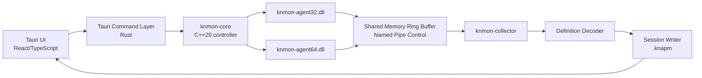

# KN Win32 API Monitor Product Design

작성일: 2026-06-08

## 1. 목적

`KN Win32 API Monitor`는 업데이트가 중단된 Rohitab API Monitor의 핵심 장점인 고밀도 API 호출 관찰 UX를 현대적인 Windows 보안 분석 워크스테이션으로 리뉴얼하는 제품이다.

목표는 단순한 호출 로그 뷰어가 아니라, Windows 10/11 환경에서 프로세스/서비스/COM/NT Native API 호출을 실시간으로 수집하고, 인자/버퍼/구조체/콜스택/에러를 깊게 디코딩하며, 세션 저장/재생/검색/자동화까지 가능한 실무형 분석 도구를 만드는 것이다.

## 2. 참고 대상

기준 제품: Rohitab API Monitor v2 Alpha

참고 URL:

- http://www.rohitab.com/apimonitor
- http://www.rohitab.com/apimonitor#Screenshots

확인한 주요 스크린샷:

- Main Window
- Summary View
- Capture Filter
- Parameters
- Structures / Unions / Arrays / Dynamic Arrays
- Breakpoints
- Buffer View
- Memory Editor
- Call Stack
- COM Monitoring
- Process View / Services
- Hook Process / Hook Service
- API Loader / Custom DLL Definition

## 3. 기존 제품에서 계승할 강점

1. 한 화면에서 전체 분석 흐름이 끝나는 고밀도 레이아웃
   - 왼쪽: API capture filter tree
   - 중앙: hooked processes 및 live summary
   - 하단: parameters, call stack, output
   - 우측: hex buffer

2. Capture Filter와 Display Filter 분리
   - Capture Filter는 실제 hook 대상과 수집 범위를 줄인다.
   - Display Filter는 이미 수집된 이벤트를 분석자가 빠르게 좁힌다.

3. Pre-call/Post-call 인자 비교
   - 입력 값과 호출 후 변경된 값이 같은 grid에서 보인다.
   - 포인터 인자, 구조체, 문자열, 버퍼 분석에 매우 중요하다.

4. Breakpoint 기반 호출 조작
   - before/after/on-error/on-exception 조건을 가진다.
   - 인자 수정, skip call, continue, break 같은 동작이 가능하다.

5. API definition 기반 디코딩
   - custom DLL definition을 XML로 작성할 수 있다.
   - enum/flag/struct/alias 정의를 통해 raw value를 의미 있는 값으로 변환한다.

6. COM monitoring
   - Win32 API뿐 아니라 COM interface/method 호출을 추적할 수 있다.

## 4. 기존 제품의 한계

1. 오래된 MDI 스타일 UI
   - 화면 정보량은 좋지만 docking, search, command palette, tab workflow가 부족하다.

2. 대용량 세션 분석 기능 부족
   - dropped event, backpressure, persistent session, replay, diff, query가 약하다.

3. 자동화/CLI/headless 운영 부족
   - 반복 분석, CI 재현, scripted capture에 부적합하다.

4. 현대 Windows 호환성 리스크
   - Windows 10/11, PPL, AppContainer, CFG/CET, high-DPI, WOW64 경계 대응이 필요하다.

5. 정의 파일 관리 난이도
   - schema validation, definition test, versioning, compiled cache가 필요하다.

6. 분석 지능 부족
   - suspicious pattern highlighting, API family timeline, file/registry/network correlation 같은 운영 분석 기능이 필요하다.

## 5. 제품 방향

권장 방향은 `고밀도 native 분석 도구 + 현대 UI + 재현 가능한 세션 포맷`이다.

제품의 세 축:

1. Live API Trace
   - launch/attach, process/service monitoring, child process auto-attach, x86/x64/WOW64 지원.

2. Deep Decode
   - pre/post parameters, return value, Win32 error, NTSTATUS, HRESULT, structs, unions, flags, buffers, call stack, symbols.

3. Operational Analysis
   - session 저장/재생, diff, query, profile, rule-based highlighting, headless export.

## 6. 기술 선택

### 6.1 추천: Tauri 2 + React/TypeScript + C++20 Native Core

최종 제품은 Tauri를 추천한다.

이유:

1. 제품의 핵심은 Web UI보다 Windows native capture engine이다.
2. Tauri는 WebView2 기반이라 Electron보다 footprint가 작다.
3. Rust/Tauri command layer를 native control plane으로 쓰기 좋다.
4. 프로세스 제어, DLL injection, IPC, session writer 같은 민감한 기능을 명시적 command/capability 경계에 둘 수 있다.
5. Windows 보안 분석 도구로 배포할 때 Electron보다 가볍고 도구 성격에 맞다.

단점:

1. Electron보다 plugin/ecosystem 예제가 적다.
2. docking layout, giant table, DevTools workflow는 Electron이 더 편하다.
3. WebView2 런타임 상태와 Windows 배포 정책을 고려해야 한다.

### 6.2 Electron을 선택할 수 있는 경우

Electron은 다음 조건이면 유리하다.

1. UI prototype을 1~2주 안에 빠르게 검증해야 한다.
2. Monaco, docking, giant table, devtools 기반 개발 속도가 최우선이다.
3. 패키지 크기와 메모리 사용량이 큰 문제가 아니다.

하지만 장기 production target은 Tauri가 더 적합하다.

## 7. 사용자 워크플로우

### 7.1 첫 분석

1. 프로세스 목록에서 `notepad.exe` 또는 대상 프로세스를 선택한다.
2. `Capture Profile`에서 File I/O preset을 선택한다.
3. `Attach` 또는 `Launch Suspended + Attach`를 실행한다.
4. 중앙 Live Trace에서 `CreateFileW`, `NtCreateFile`, `ReadFile`, `WriteFile`, `CloseHandle` 호출을 본다.
5. 호출을 선택하면 Inspector에서 parameters, buffers, return/error, call stack을 확인한다.
6. 필요하면 session을 저장하고 JSONL/CSV로 export한다.

### 7.2 고급 분석

1. API Library에서 모듈/API family를 선택한다.
2. Capture Filter로 수집 범위를 줄인다.
3. Display Filter로 특정 path, module, error, duration, thread만 본다.
4. Breakpoint를 걸고 before-call 인자를 수정하거나 skip call을 테스트한다.
5. Pre/Post diff로 출력 buffer 또는 structure mutation을 확인한다.
6. 세션 replay에서 같은 query를 반복 실행한다.

### 7.3 반복 운영

1. capture profile을 저장한다.
2. CLI로 headless capture를 실행한다.
3. `.knapm` session을 저장한다.
4. JSONL/Parquet export를 분석 파이프라인에 넣는다.
5. rule pack으로 suspicious trace를 highlight한다.

## 8. UX 정보 구조

### 8.1 Main Workspace

권장 main layout:

```text
+----------------------+------------------------+-----------------------------+
| Targets / API Library | Hooked Processes       | Live Trace                  |
| Capture Profiles      | Threads / Modules      | Summary / Call Tree         |
+----------------------+------------------------+-----------------------------+
| Running Processes     | Parameters / Structs / Buffers / Call Stack / Output        |
| Services              | Memory / Modules / Breakpoints / Session Info               |
+----------------------+--------------------------------------------------------------+
```

### 8.2 Left Pane

Tabs:

1. Targets
   - processes
   - services
   - recent targets
   - launch configs

2. API Library
   - NT Native
   - Kernel32/KernelBase
   - File/Registry/Process/Thread/Memory/Network/Security
   - COM interfaces
   - custom DLL definitions

3. Capture Profiles
   - File I/O
   - Registry
   - Process/Thread
   - Memory
   - Network
   - COM
   - Anti-cheat research preset

### 8.3 Center Pane

Live Trace table columns:

- #
- relative time
- pid
- tid
- process
- module
- api
- arguments
- return value
- error
- duration
- stack hash
- tags

Modes:

- Flat Summary
- Call Tree
- Thread View
- Module View
- Error View
- Timeline View

### 8.4 Inspector Pane

Tabs:

1. Parameters
   - type
   - name
   - pre-call value
   - post-call value
   - decoded value

2. Buffer
   - hex
   - ASCII
   - UTF-16
   - structure overlay
   - pre/post diff

3. Call Stack
   - module
   - address
   - symbol
   - offset
   - source if available

4. Return/Error
   - Win32 error
   - NTSTATUS
   - HRESULT
   - formatted message

5. Memory
   - address
   - region info
   - protection
   - read/write if permitted

6. Output
   - collector logs
   - hook events
   - dropped event warnings
   - agent status

## 9. Core Architecture



### 9.1 UI Layer

Module: `knmon-ui`

Responsibilities:

- docking workspace
- virtualized trace table
- filter editor
- definition editor
- session replay UI
- breakpoint editor
- export UI

Recommended libraries:

- React
- TypeScript
- TanStack Table
- TanStack Virtual
- Monaco Editor
- Dockview or equivalent docking layout
- Zustand or Redux Toolkit for local UI state

### 9.2 Command Layer

Module: `knmon-tauri`

Responsibilities:

- strict command allowlist
- target process operations
- capture session lifecycle
- file open/save/export
- native core process management
- UI event stream bridge

### 9.3 Native Controller

Module: `knmon-core`

Responsibilities:

- enumerate processes/services/modules
- launch suspended
- attach/detach
- inject correct x86/x64 agent
- manage child process auto-attach
- control breakpoints
- supervise agents
- expose stable IPC API to Tauri layer

### 9.4 Agent DLL

Modules:

- `knmon-agent32.dll`
- `knmon-agent64.dll`

Responsibilities:

- install selected hooks
- capture pre-call arguments
- capture post-call return/error
- snapshot buffers safely
- capture call stack
- write events to shared memory ring buffer
- handle breakpoint commands

Initial hook methods should be pluggable:

1. IAT/EAT hook where appropriate
2. inline trampoline hook for selected exports
3. optional VEH/hardware breakpoint mode for special cases

### 9.5 Collector

Module: `knmon-collector`

Responsibilities:

- consume ring buffer
- detect dropped events
- normalize event records
- call decoder
- write session chunks
- stream rows to UI
- enforce backpressure policy

## 10. Event Model

### 10.1 Base Event

Fields:

- event_id
- session_id
- timestamp_qpc
- relative_time_ns
- process_id
- thread_id
- process_name
- image_path
- module_name
- api_name
- api_hash
- call_depth
- correlation_id
- phase
- arguments
- return_value
- last_error
- ntstatus
- hresult
- duration_ns
- stack_id
- flags
- tags

### 10.2 Argument Model

Fields:

- index
- name
- type
- direction
- raw_value
- decoded_value
- pointer_address
- memory_snapshot_id
- decode_status

Direction:

- in
- out
- inout
- return

Decode status:

- decoded
- partial
- invalid_pointer
- unreadable_memory
- definition_missing
- truncated

### 10.3 Memory Snapshot

Fields:

- snapshot_id
- process_id
- address
- requested_size
- captured_size
- region_base
- region_size
- protection
- state
- type
- bytes
- encoding_hint
- truncation_reason

## 11. API Definition System

기존 Rohitab XML의 장점은 유지하되, 새 시스템은 schema validation과 testability를 갖춰야 한다.

권장 포맷:

- authoring: YAML 또는 JSON
- compatibility importer: Rohitab-style XML
- compiled cache: binary indexed definition DB

Definition features:

- module
- api
- calling convention
- return type
- last-error function
- parameters
- direction
- pointer depth
- buffer length expression
- struct/union/enum/flag/alias
- success condition
- failure condition
- error decoder
- OS version guard
- architecture guard

Example concept:

```yaml
module: kernel32.dll
apis:
  - name: CreateFileW
    convention: stdcall
    error: GetLastError
    return:
      type: HANDLE
      invalid: INVALID_HANDLE_VALUE
    params:
      - name: lpFileName
        type: LPCWSTR
        direction: in
      - name: dwDesiredAccess
        type: DWORD
        decode: file_access_mask
      - name: dwShareMode
        type: DWORD
        decode: file_share_mask
      - name: lpSecurityAttributes
        type: LPSECURITY_ATTRIBUTES
        direction: in
      - name: dwCreationDisposition
        type: DWORD
        decode: file_creation_disposition
      - name: dwFlagsAndAttributes
        type: DWORD
        decode: file_flags_attributes
      - name: hTemplateFile
        type: HANDLE
        direction: in
```

## 12. Breakpoint Model

Breakpoint condition:

- API name
- module name
- process/thread
- argument predicate
- return/error predicate
- call count
- stack/module predicate

Breakpoint timing:

- before call
- after call
- on error
- on exception

Actions:

- break
- continue
- edit argument
- edit buffer
- skip call
- force return value
- force last error
- capture extended memory
- log note

Operational caveats:

1. 모든 mutation은 audit log에 남긴다.
2. skip/force-return은 calling convention과 stack cleanup을 엄격히 검증한다.
3. target process crash를 막기 위해 timeout과 emergency detach가 필요하다.
4. protected/PPL process는 명확히 unsupported 또는 limited로 표시한다.

## 13. Filter System

### 13.1 Capture Filter

목적:

- 실제 hook 대상과 event volume을 줄인다.

조건:

- module
- api family
- specific API
- process
- service
- child process
- architecture
- COM interface

### 13.2 Display Filter

목적:

- 저장되거나 수집된 이벤트를 빠르게 탐색한다.

조건:

- api contains
- module is
- pid/tid
- duration greater than
- return failed
- error code is
- path contains
- buffer contains
- stack contains module
- tag is

Query syntax는 UI builder와 text query를 모두 지원한다.

Example:

```text
api in ["CreateFileW", "NtCreateFile"] and error != 0 and path contains "\\drivers\\"
```

## 14. Session Format

확장자: `.knapm`

권장 구조:

- manifest.json
- metadata.sqlite
- events/*.zst
- memory/*.zst
- symbols/*
- definitions/*
- notes.jsonl

Design goals:

1. append-only write
2. crash-tolerant recovery
3. streaming replay
4. indexed query
5. export-friendly schema
6. definition/version snapshot 포함

Exports:

- JSONL
- CSV
- SQLite
- Parquet

## 15. Reliability Requirements

1. Dropped event visibility
   - UI status bar에 dropped count와 drop rate를 항상 표시한다.

2. Backpressure policy
   - low priority buffer snapshots를 먼저 줄인다.
   - call summary event는 최대한 유지한다.

3. Safe memory read
   - `VirtualQueryEx`/agent-side SEH guard를 사용한다.
   - page boundary, guard page, unreadable pointer를 decode_status로 남긴다.

4. Detach safety
   - hook uninstall 실패 시 target crash 위험을 표시한다.
   - controller crash 후에도 agent heartbeat timeout으로 self-disable한다.

5. Version compatibility
   - UI/core/agent protocol version을 handshake한다.
   - x86/x64 agent mismatch를 hard fail한다.

6. High-volume performance
   - UI table은 반드시 virtualization을 사용한다.
   - collector는 UI 렌더링과 session write를 분리한다.

## 16. Security And Operational Boundaries

1. Admin 권한이 필요한 작업을 명확히 분리한다.
2. PPL, EDR-protected, anti-tamper target은 attach 실패 원인을 정확히 표시한다.
3. signed binary와 unsigned dev build를 구분한다.
4. DLL injection, memory edit, skip call 기능은 explicit confirmation과 audit trail을 가진다.
5. definition 파일은 schema 검증 후 로드한다.
6. Tauri command는 allowlist 기반으로 노출한다.
7. session file에는 민감 경로/문자열/버퍼가 들어갈 수 있으므로 redaction/export option을 둔다.

## 17. MVP Scope

### Phase 0: Repository Bootstrap

Deliverables:

- repo structure
- build scripts
- coding style docs
- basic Tauri shell
- native core skeleton
- x86/x64 build pipeline

### Phase 1: File I/O Trace

Target APIs:

- CreateFileW
- CreateFileA
- NtCreateFile
- ReadFile
- WriteFile
- CloseHandle

Deliverables:

- process enumerate
- launch/attach
- live trace table
- basic parameter decode
- return/error decode
- session save JSONL

### Phase 2: Deep Inspector

Deliverables:

- pre/post parameters
- buffer snapshot
- hex/UTF-16 viewer
- call stack capture
- module/symbol display
- display filter

### Phase 3: Capture Profiles

Deliverables:

- API library tree
- capture profile editor
- file/registry/process/thread/memory presets
- profile persistence
- dropped event telemetry

### Phase 4: Breakpoints

Deliverables:

- before/after breakpoint
- parameter edit
- skip call
- force return/error
- audit log

### Phase 5: Definition System

Deliverables:

- YAML/JSON definition loader
- Rohitab XML importer
- schema validator
- definition test runner
- compiled definition cache

### Phase 6: COM And Advanced Windows

Deliverables:

- COM interface/method decode
- GUID/name decoding
- service attach
- child process auto-attach
- WOW64 boundary hardening

## 18. Proposed Repository Layout

```text
kn-win32apimon/
  docs/
    product-design.md
    architecture.md
    definition-schema.md
    roadmap.md
  apps/
    knmon-ui/
  crates/
    knmon-tauri/
  native/
    knmon-core/
    knmon-agent32/
    knmon-agent64/
    knmon-collector/
    knmon-common/
  definitions/
    win32/
    nt/
    com/
    custom/
  samples/
    targets/
    sessions/
  tools/
    def-validator/
    session-export/
  tests/
    integration/
    definition/
```

## 19. Initial Engineering Decisions

1. UI framework
   - Decision: Tauri 2 + React/TypeScript
   - Reason: native-heavy security tool, lower footprint, stronger command boundary.

2. Capture core language
   - Decision: C++20
   - Reason: Windows ABI, injection, hook trampolines, SEH, x86/x64 calling details.

3. Tauri side language
   - Decision: Rust
   - Reason: Tauri native layer, command validation, process supervision glue.

4. Session format
   - Decision: `.knapm` directory or zip-like container with SQLite metadata and zstd chunks.
   - Reason: crash recovery, streaming, query, export.

5. Definition authoring
   - Decision: YAML/JSON first, Rohitab XML importer second.
   - Reason: authoring ergonomics and schema validation.

6. Hooking approach
   - Decision: pluggable hook backend.
   - Reason: IAT/EAT/inline/VEH have different stability and coverage tradeoffs.

## 20. Open Questions

1. 첫 릴리스에서 kernel-mode helper를 완전히 제외할지 여부.
2. ETW를 validation/side-channel source로 언제 붙일지 여부.
3. API definition format을 YAML로 확정할지 JSON schema 중심으로 갈지 여부.
4. Breakpoint mutation 기능을 MVP에 넣을지, read-only monitor 안정화 후 넣을지 여부.
5. Session container를 directory layout으로 둘지 single-file package로 둘지 여부.
6. Symbol/PDB resolution을 local-only로 시작할지 symbol server integration까지 포함할지 여부.

## 21. Recommended Next Step

다음 작업은 구현보다 먼저 repo bootstrap을 잡는 것이 좋다.

권장 순서:

1. `docs/architecture.md` 작성
2. `docs/definition-schema.md` 작성
3. Tauri app skeleton 생성
4. C++ native solution skeleton 생성
5. process enumerate + UI target list 구현
6. File I/O MVP capture pipeline 구현

